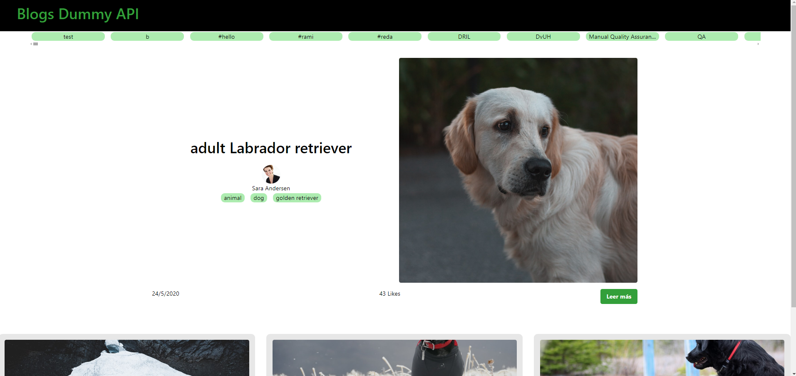
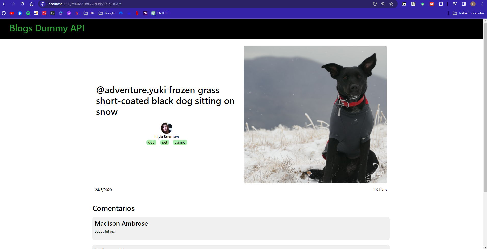

# Blogs

Creado por: Harrison Felipe Velandia Pinto

## Dependencias necesarias
- [NodeJs](https://nodejs.org/en) : Node.js es un entorno de ejecución de JavaScript diseñado para construir aplicaciones de red escalables y eficientes.
Es necesaria su instalación para utilizar su gestor de paquetes npm.

- [Git](https://git-scm.com/downloads) : Es un sistema de control de versiones que facilita el trabajo simultaneo. No es requerido pero facilita la obtención del repositorio por medio de comandos.

## Procedimiento de ejecución

Inicialmente, se debe navegar desde la terminal hasta la ruta donde se quiere descargar el código, por ejemplo, en Windows, si se quiere descargar en Documents se debe ejecutar:

``` cd C:/Users/%USERNAME%/Documents ```

Luego, se debe obtener el repositorio con el siguiente comando

```git clone https://github.com/FelipeVel/blog.git```

Después de tener el código, se debe navegar a la carpeta donde se descargó el repositorio:

``` cd blog ```

Para ejecutar la versión en esta rama, se debe hacer el cambio de rama en el repositorio local, esto se hace con:

``` git checkout despues-de-entrega ```

Luego, se deben configurar las variables de entorno, estos son los valores:

```
REACT_APP_DUMMY_API_BASE_URL=https://dummyapi.io/data/v1
REACT_APP_DUMMY_APP_ID=6616e3c08d6bd03efdbc907e
```

Una vez hecho esto, se deben obtener las dependencias, y luego, ejecutar el código, esto se hace con los siguientes comandos:

``` 
npm i 
npm run start
```

Una vez ejecutado el proyecto, se puede consultar en la direccion [localhost:3000](http://localhost:3000/)

El bloque de comandos completo es el siguiente:
```
cd C:/Users/%USERNAME%/Documents
git clone https://github.com/FelipeVel/blog.git
cd blog
git checkout despues-de-entrega
npm i 
npm run start
```

## Pruebas del sitio

### Homepage



### Post


